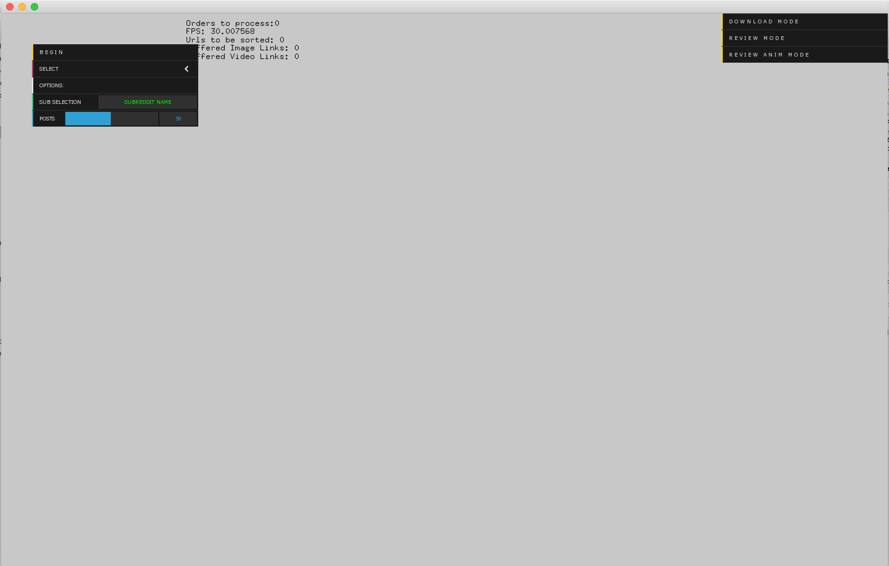
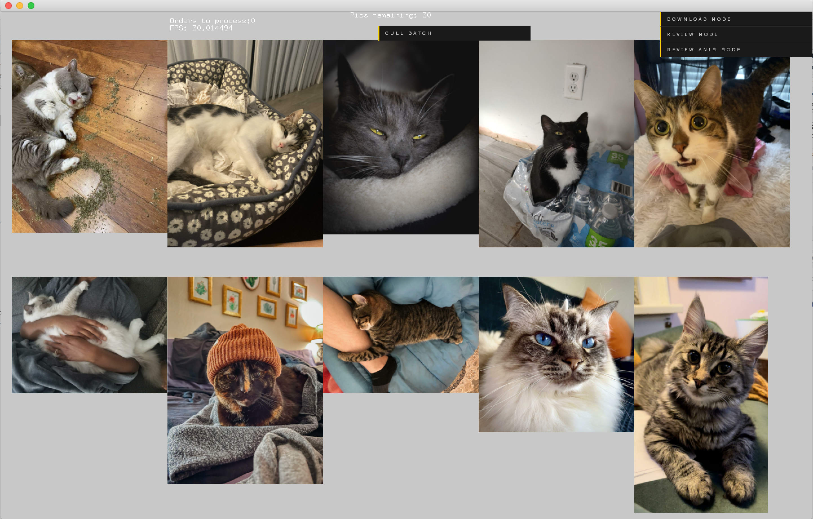

# REDDOWN HAS BEEN REPLACED BY LAZBANKPY
# Reddown
A photobashing collection creation and curation app. Assists the user in downloading, sifting through, and sorting images from subreddits of the desired theme and source material in bulk.

## Download Screen

Enter a subreddit name to download from, or simply choose to download from a user-predefined list. The app tracks images it has downloaded previously, and will only download new images.

## Image Sifting Screen

Review the images 20 at a time, quickly throwing away images you don't want. Images not culled will get saved to the "filtered" folder to get sorted later.
